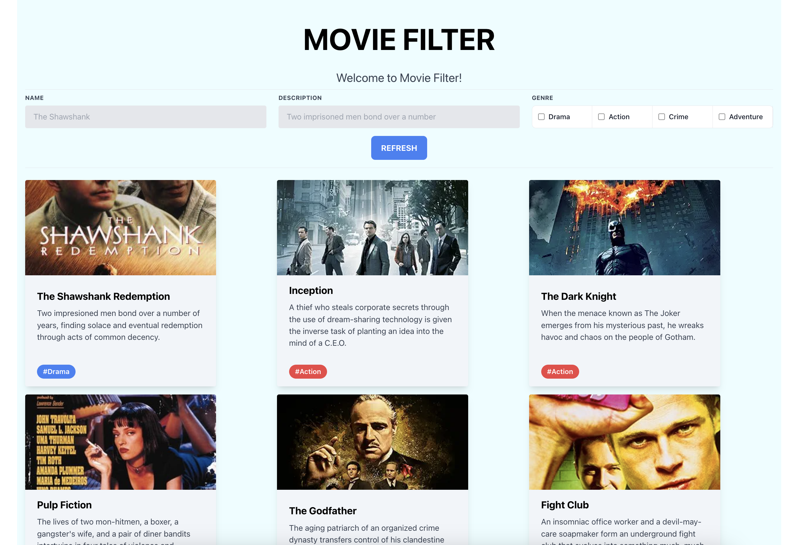
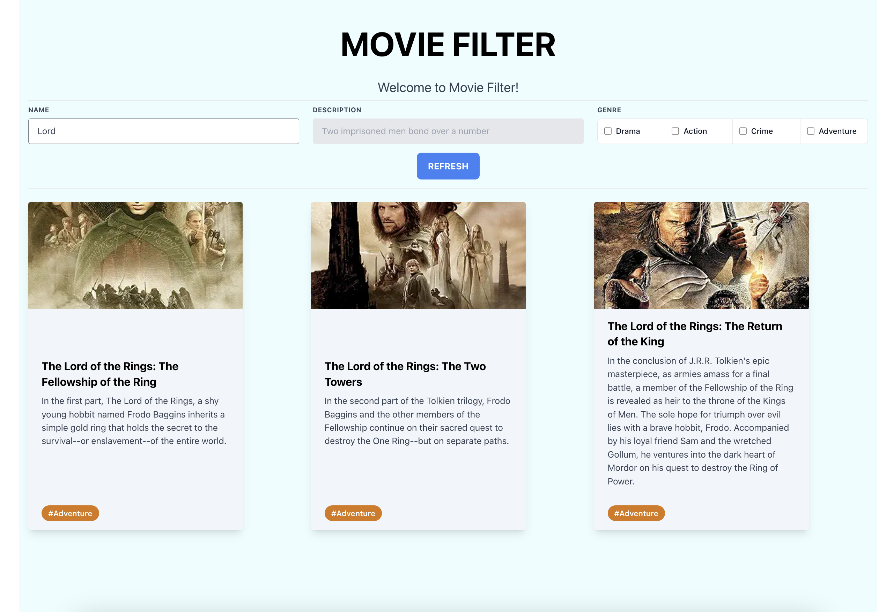
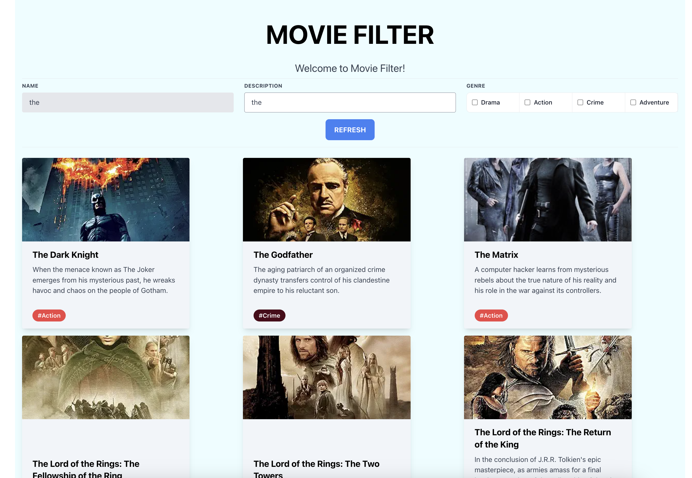
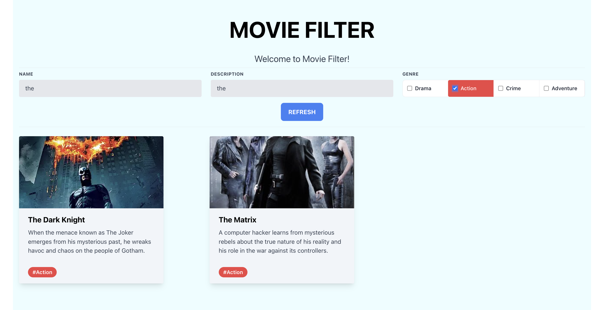
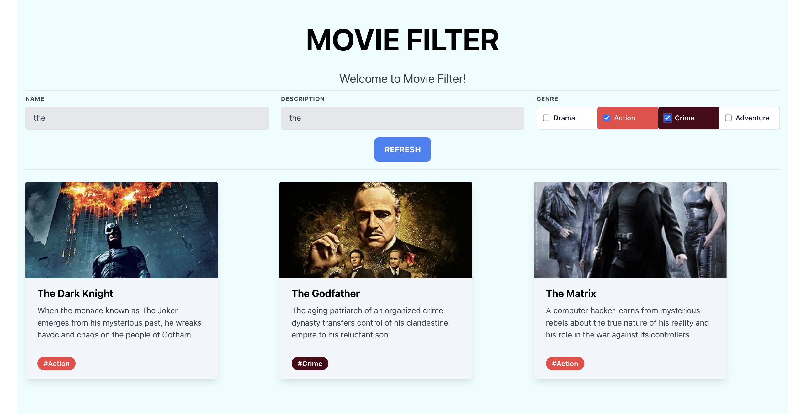
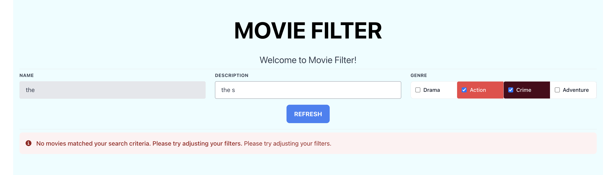

# MOVIE FILTER

## Descripción

Esta es una aplicación de filtrado de películas que permite a los usuarios buscar y filtrar películas por nombre, descripción y género. La aplicación está construida con React y utiliza Axios para obtener los datos de un archivo JSON.

## Características

- Mostrar una lista de películas con **título**, **descripción** y **género**.
- Filtrar películas por nombre, descripción y género.
- Actualizar dinámicamente la lista de películas según los criterios de búsqueda.
- Mostrar un mensaje de error si no se encuentran coincidencias.
- Mostrar un mensaje de carga mientras los datos se están obteniendo.

## Instalación

1. Clona el repositorio:
    ```sh
    git clone https://github.com/ElannyTorres/movie-filter.git
    cd movie-filter
    ```

2. Instala las dependencias:
    ```sh
    npm install
    ```

3. Inicia la aplicación:
    ```sh
    npm start
    ```

## Uso

- Ingresa un nombre de película en el campo **"Name"** para filtrar por nombre.
- Ingresa una descripción de película en el campo **"Description"** para filtrar por descripción.
- Selecciona uno o más géneros para filtrar por **Genre**.
- Presiona el botón **"REFRESH"** para restablecer los filtros y mostrar todas las películas.

## Vistas

- Vista Inicial de la aplicación web


- Filtrado por el campo **Name**


- Filtrado por el campo **Description**


- Filtrado por el campo **Genre**


- Filtrado por dos o más campos de **Genre**


- Mensaje de **Error** al no haber coincidencias con la búsqueda


## Estructura del Proyecto

- `src/components/Card.js`: Componente para mostrar los detalles de una película.
- `src/components/InputField.js`: Componente para los campos de entrada (nombre y descripción).
- `src/components/GenreFilter.js`: Componente para filtrar por géneros.
- `src/components/AlertMessage.js`: Componente para mostrar mensajes de alerta.
- `src/App.js`: Componente principal de la aplicación.

## Tecnologías Utilizadas

- React
- Axios
- Tailwind CSS

## Principios SOLID y Buenas Prácticas de Desarrollo

### Principios SOLID

1. **Principio de Responsabilidad Única (SRP)**:
   - Cada componente tiene una única responsabilidad. Por ejemplo, `Card` es responsable de mostrar los detalles de una película, mientras que `App` maneja el estado global y la lógica de filtrado.

2. **Principio de Abierto/Cerrado (OCP)**:
   - El código está abierto para la extensión, pero cerrado para la modificación. Puedes extender la funcionalidad de los componentes sin necesidad de modificarlos directamente.

3. **Principio de Sustitución de Liskov (LSP)**:
   - Aunque no se aplica directamente debido a la falta de jerarquía de herencia, los componentes pueden ser sustituidos sin alterar la funcionalidad general.

4. **Principio de Segregación de Interfaces (ISP)**:
   - Los componentes están bien segregados, como `InputField` para los campos de entrada y `GenreFilter` para los filtros de género, lo que permite una reutilización más fácil y modular.

5. **Principio de Inversión de Dependencias (DIP)**:
   - Se utiliza `useEffect` y `useState` para manejar dependencias y efectos, manteniendo los componentes desacoplados y centrados en su propia lógica.

### Buenas Prácticas de Desarrollo

- **Separación de la lógica de negocio de la presentación**:
  - La lógica de filtrado se maneja en el componente `App`, mientras que la presentación se maneja en `Card` y otros componentes de UI.

- **Uso de hooks para manejar el estado y efectos**:
  - `useState` y `useEffect` se utilizan para manejar el estado y los efectos secundarios de manera eficiente y clara.

- **Manejo de errores y estado de carga**:
  - `isLoading` controla la visualización del mensaje "Loading..." y asegura que los datos se cargan antes de intentar mostrarlos.

- **Componentes reutilizables y modulares**:
  - Los componentes como `InputField`, `GenreFilter` y `AlertMessage` son pequeños, específicos y reutilizables, siguiendo las mejores prácticas de desarrollo.
